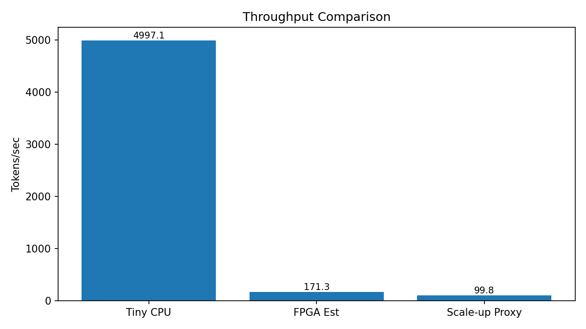
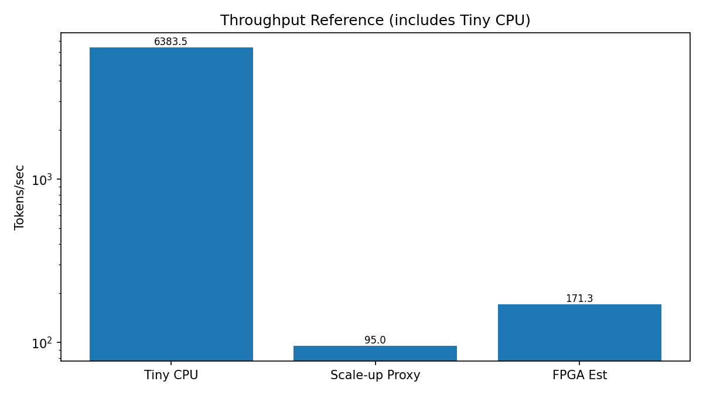
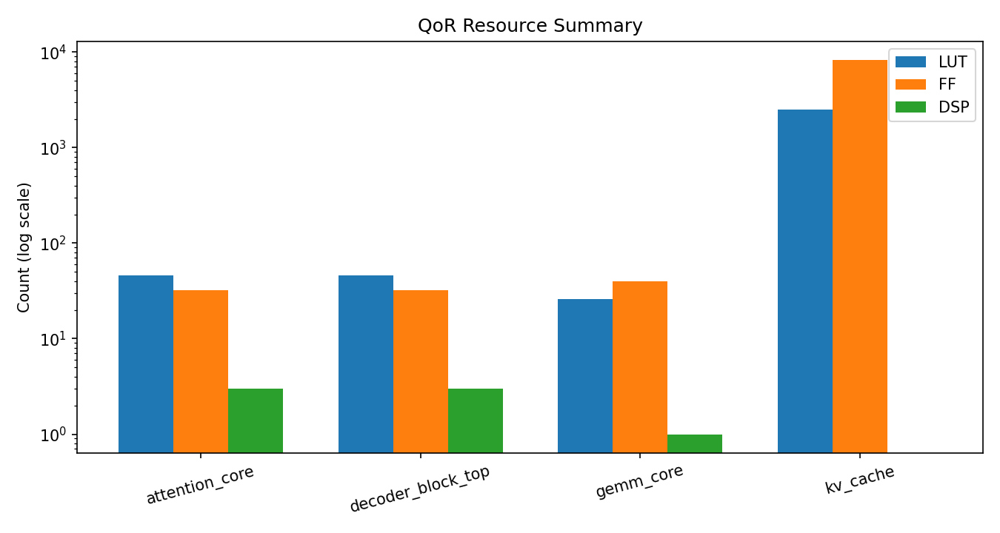
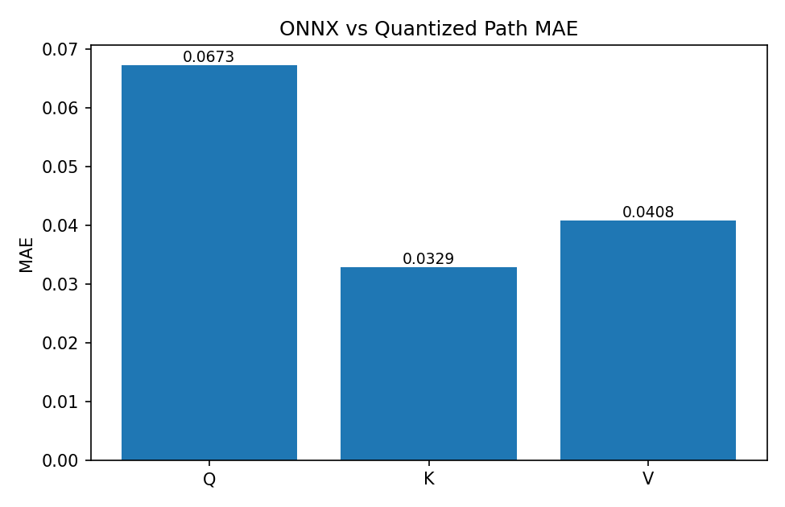
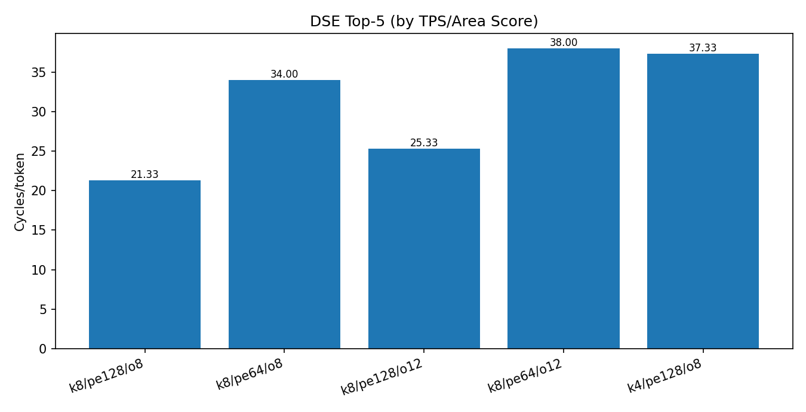
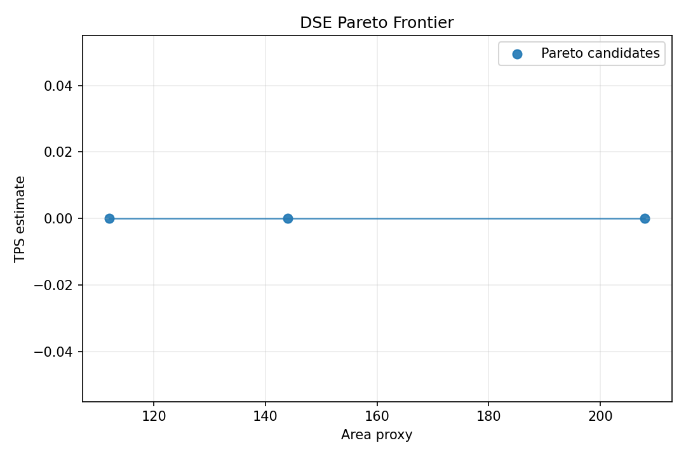
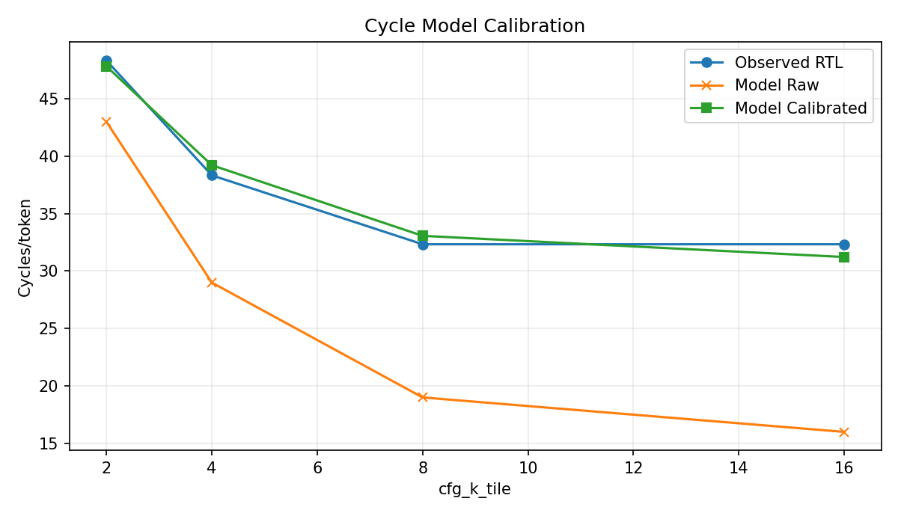

# Final Portfolio Report

- generated_utc: 2026-02-16T17:36:07Z
- benchmark_suite_timestamp_utc: 2026-02-16T17:12:38Z
- scope: Boardless LLM inference accelerator MVP + optimization round (N1~N13)

## KPI Summary

| KPI | Value |
|---|---:|
| tiny_cpu_tps | 6383.488061 |
| fpga_est_tps | 171.326754 |
| scaleup_proxy_tps | 94.960900 |
| speedup_fpga_est_vs_scaleup_proxy (primary) | 1.804182 |
| speedup_fpga_est_vs_tiny_cpu | 0.026839 |
| tiny_cpu_ms_per_token | 0.156654 |
| fpga_est_ms_per_token | 5.836800 |
| onnx_mae_avg | 0.047009 |
| qor_best_wns_ns | 2.868000 |
| rtl_backend_cycles_per_token | 16.000000 |

## Figures

### Throughput (Primary KPI)


### Throughput (Reference, includes Tiny CPU)


### QoR Resources


### ONNX MAE


## QoR Table

| top | lut | ff | dsp | bram | uram | wns_ns |
|---|---:|---:|---:|---:|---:|---:|
| attention_core | 146 | 159 | 3 | 0 | 0 | 2.558 |
| decoder_block_top | 87 | 79 | 3 | 0 | 0 | 2.404 |
| gemm_core | 158 | 150 | 1 | 0 | 0 | 2.558 |
| kv_cache | 38 | 66 | 0 | 0.5 | 0 | 2.868 |
| npu_top | 380 | 324 | 0 | 0 | 0 | 2.452 |

## Validation Policy

1. Run each validation step up to 10 times.
2. Stop early when PASS is reached once.
3. Record PASS/FAIL/BLOCKED in logs.

## Scope Note

- Current RTL is a boardless proxy-kernel implementation for pre-silicon bring-up.
- Core pipeline and verification automation are real; full Transformer operator completeness is a next-phase target.
- Primary speedup KPI uses fpga_est_tps vs scaleup_proxy_tps (same proxy scale).

## N8 DSE Summary

- trials: 8
- pareto_points: 3
- best cfg_k_tile: 8
- best pe_mac_per_cycle: 128
- best token_overhead_cycles: 8
- best cycles_per_token: 21.333333
- best score_tps_per_area: 45072.115385





## N9 Cycle Model Calibration

- scale: 0.614952
- bias: 21.383361
- mae_raw: 11.083333
- mae_calibrated: 0.808881
- improvement_pct: 92.70



## Reproduce

```powershell
powershell -ExecutionPolicy Bypass -File scripts/reproduce_portfolio.ps1
```
